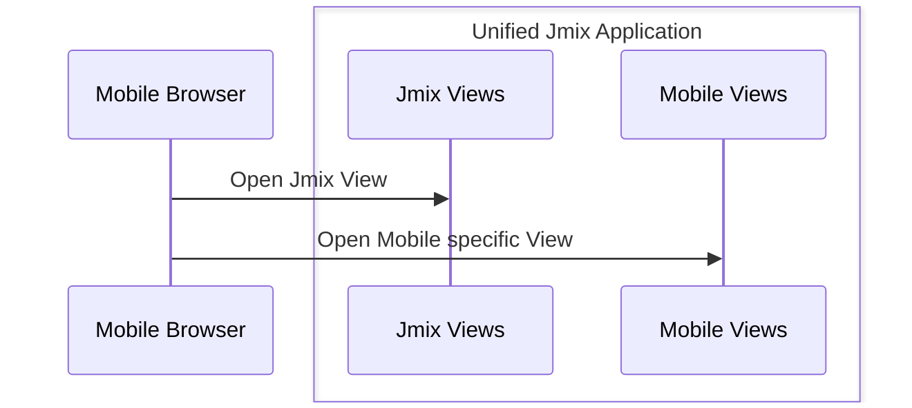
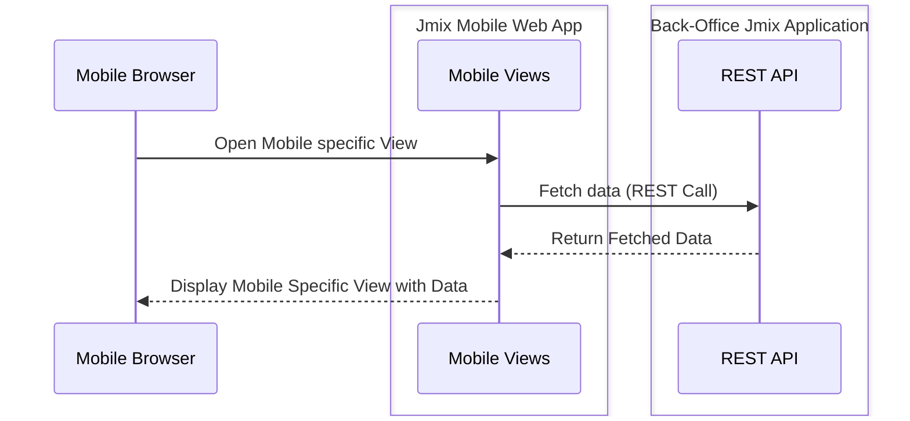
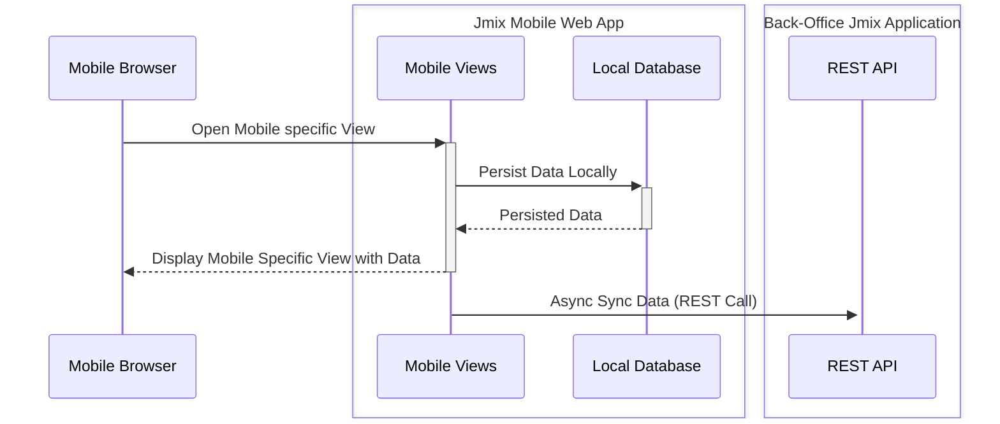
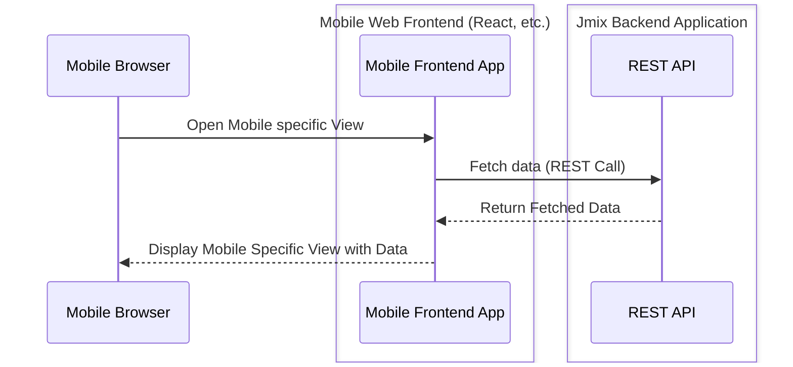

### Option 1

```mermaid
sequenceDiagram
    participant MobileBrowser as Mobile Browser

        MobileBrowser ->> BackOfficeViews: Open Jmix View
        MobileBrowser ->> MobileViews: Open Mobile specific View
    
    box Unified Jmix Application
        participant MobileViews as Mobile Views
        participant BackOfficeViews as Jmix Views
    end
```

### Option 2

#### Option 2a: Transient persistence

```mermaid
sequenceDiagram
    participant MobileBrowser as Mobile Browser
    MobileBrowser ->> MobileViews: Open Mobile specific View
    MobileViews ->> RESTAPI: Fetch data (REST Call)
    RESTAPI -->> MobileViews: Return Fetched Data
    MobileViews -->> MobileBrowser: Display Mobile Specific View with Data

    box Jmix Mobile Web App
        participant MobileViews as Mobile Views
    end

    box Back-Office Jmix Application
        participant RESTAPI as REST API
    end
```

#### Option 2b: Local Persistence

```mermaid
sequenceDiagram
    participant MobileBrowser as Mobile Browser
    MobileBrowser ->>+ MobileViews: Open Mobile specific View
    MobileViews ->>+ MobileDB: Persist Data Locally
    MobileDB -->>- MobileViews: Persisted Data
    MobileViews -->>- MobileBrowser: Display Mobile Specific View with Data

%% Async synchronization happens later
    MobileViews ->>+ RESTAPI: Async Sync Data (REST Call)

    box Jmix Mobile Web App
        participant MobileViews as Mobile Views
        participant MobileDB as Local Database
    end

    box Back-Office Jmix Application
        participant RESTAPI as REST API
    end
```

### Option 3

```mermaid
sequenceDiagram
    participant MobileBrowser as Mobile Browser
    MobileBrowser ->> FrontendApp: Open Mobile specific View
    FrontendApp ->> RESTAPI: Fetch data (REST Call)
    RESTAPI -->> FrontendApp: Return Fetched Data
    FrontendApp -->> MobileBrowser: Display Mobile Specific View with Data

    box Mobile Web Frontend (React, etc.)
        participant FrontendApp as Mobile Frontend App
    end

    box Jmix Backend Application
        participant RESTAPI as REST API
    end
```